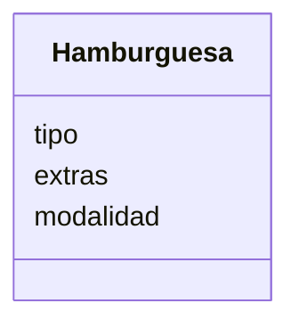

# Descripcion
    Un restaurante quiere ofrecer hamburguesas
    Los clientes pueden elegir entre hamburguesa de: res, pollo
    o vegetariana.
    Los clientes pueden agregar extras como: lechuga, tomate, 
    cebolla y mayonesa
    Ademas los clientes pueden decidir comer en el restaurante 
    o llevar su pedido

# Análisis

Requisitos:
- Ofrecer hamburguesas de res, pollo o vegetariana
- Permitir agregar extras: lechuga, tomate, cebolla, mayonesa
- Permitir elegir comer en el restaurante o llevar el pedido

Objetos:
- Hamburguesa

Características:
- Hamburguesa
    - tipo (res, pollo, vegetariana)
    - extras (lechuga, tomate, cebolla, mayonesa)
    - modalidad (comer en el restaurante o para llevar)

Acciones:
- (No hay acciones)

# Diseño:

Clases:
- Hamburguesa 🍔:
    - Nombre: Hamburguesa
    - Atributos:
        - tipo
        - extras
        - modalidad
    - Métodos:
        - (No hay métodos)

