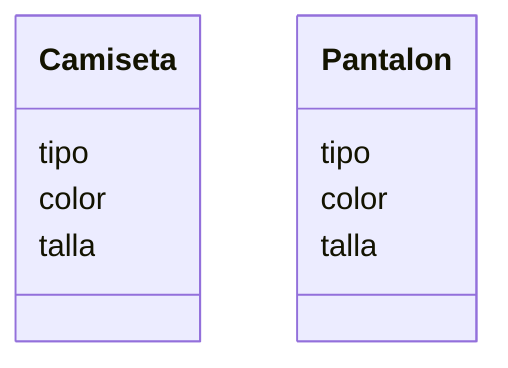

# Descripcion
    Una tienda de ropa quiere ofrecer camisetas y pantalones
    Los clientes pueden elegir entre: camiseta
    de manga corta o larga y pantalón de mezclilla o tela
    Las camisetas pueden ser de color rojo, azul o verde
    y los pantalones de color negro, gris o blanco
    Las camisetas tienen las tallas: S, M, L, XL
    Los pantalones tienen las tallas desde la 32 hasta la 44

# Análisis

Requisitos:
- Ofrecer camisetas de manga corta o larga
- Ofrecer pantalones de mezclilla o tela
- Permitir elegir colores: camisetas (rojo, azul, verde) y pantalones (negro, gris, blanco)
- Permitir elegir tallas: camisetas (S, M, L, XL) y pantalones (32–44)

Objetos:
- Camiseta
- Pantalón

Características:
- Camiseta
    - tipo (manga corta o larga)
    - color (rojo, azul, verde)
    - talla (S, M, L, XL)
- Pantalón
    - tipo (mezclilla o tela)
    - color (negro, gris, blanco)
    - talla (32–44)

Acciones:
- (No hay acciones)

# Diseño:

Clases:
- Camiseta 👕:
    - Nombre: Camiseta
    - Atributos:
        - tipo
        - color
        - talla
    - Métodos:
        - (No hay métodos)
- Pantalon 👖:
    - Nombre: Pantalon
    - Atributos:
        - tipo
        - color
        - talla
    - Métodos:
        - (No hay métodos)

