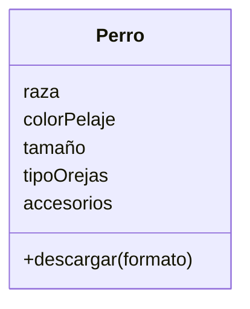

# Descripcion
    Estas diseñando una app para dibujar de perros con IA 
    los usuarios pueden seleccionar características como 
    la raza (por ejemplo, labrador o pastor alemán), el color 
    del pelaje, el tamaño y el tipo de orejas.
    Además, pueden agregar hasta dos accesorios, como sombreros 
    o gafas.
    El dibujo final puede descargarse en formato PNG o JPG. 

# Análisis

Requisitos:
- Seleccionar raza del perro (ej. labrador, pastor alemán)
- Seleccionar color del pelaje
- Seleccionar tamaño
- Seleccionar tipo de orejas
- Agregar hasta dos accesorios (sombreros, gafas, etc.)
- Descargar el dibujo final en formato PNG o JPG

Objetos:
- Perro

Características:
- Perro
    - raza
    - colorPelaje
    - tamaño
    - tipoOrejas
    - accesorios
- Dibujo
    - formato (PNG o JPG)

Acciones:
- descargar(formato)

# Diseño:

Clases:
- Perro 🐶:
    - Nombre: Perro
    - Atributos:
        - raza
        - colorPelaje
        - tamaño
        - tipoOrejas
        - accesorios
    - Métodos:
        - descargar(formato)

