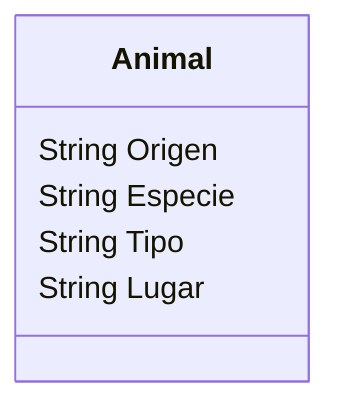

Un zoológico quiere llevar un registro de los animales que llegan 
a sus instalaciones.
Necesitan registrar su especie, tipo y lugar donde los encontraron.
Los animales del zoológico pueden ser mamíferos, reptiles o aves.
El origen de todos los animales es "feral". 
Este zoológico cuenta con 2 mamíferos, 1 reptil y 1 ave

- Realiza el análisis y diseño de la clase Animal
- Escribe el codigo en Python para crear la clase Animal
- Instancia los 4 animales con sus respectivos atributos

Requisitos:
- Registrar animales.
- Registrar los atributos de cada animal.
- Todos los animales tienen como origen = "feral".
- El zoológico tiene:
    - 2 mamíferos
    - 1 reptil
    - 1 ave

Objetos:
- Animal

Características de la clase Animal:
- Origen (por defecto = "feral")
- Especie
- Tipo (mamífero, reptil o ave)
- Lugar (dónde fue encontrado)

Acciones:
- (No hay acciones explícitas, solo registrar los animales).

