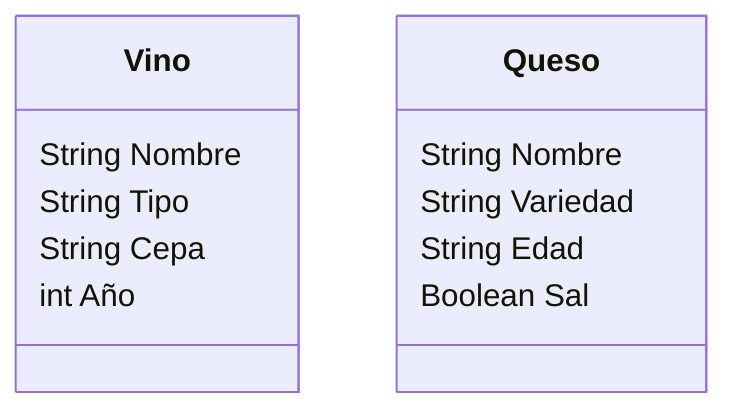

Una vinoteca quiere registrar los vinos y quesos que ofrecen.
De cada vino se necesita registrar su nombre, tipo, cepa y 
año de producción.
De cada queso se necesita registrar su nombre, variedad, 
edad y si lleva sal.
La vinoteca tiene en su inventario 4 vinos y 3 quesos 

- Realiza el análisis y diseño de las clases Vino y Queso
- Escribe el codigo en Python para crear la clases Vino y Queso
- Instancia los 4 vinos y 3 quesos con sus respectivos atributos

Análisis de las clases

Requisitos:
- Registrar vinos y quesos en la vinoteca.
- De los vinos se debe registrar:
    - nombre
    - tipo
    - cepa
    - año de producción
- De los quesos se debe registrar:
    - nombre
    - variedad
    - edad
    - si lleva sal (sí/no)
- Inventario: 4 vinos y 3 quesos

Objetos
- Vino
- Queso

Características
Clase Vino
- Nombre
- Tipo
- Cepa
- Año
Clase Queso
- Nombre
- Variedad
- Edad
- Sal (booleano o texto)

