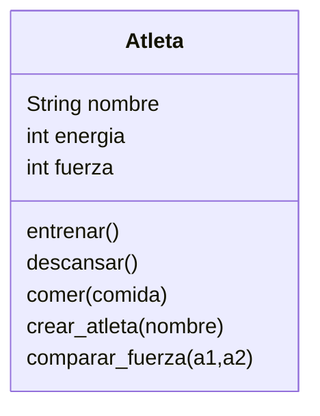

Imagina un juego de rol en el que el personaje principal es un atleta.
Este personaje tiene tres atributos principales:

nombre: identifica al atleta
energía: representa su nivel de energía actual.
fuerza: indica su capacidad física.

Cada atleta puede realizar las siguientes acciones:

- Entrenar: aumenta su fuerza, pero consume energía.
- Descansar: recupera energía.
- Comer: solo puede consumir hamburguesas, lo que también le ayuda a recuperar energía.

Realiza el análisis y diagrama de clases de la clase Atleta en el archivo ejercicio_01.md.
Escribe el codigo en Python para la clase Atleta en el archivo ejercicio_01.py.
Implementa los métodos de instancia, clase y estáticos según corresponda.
Instancia dos Atletas y prueba sus métodos.

Análisis

Requisitos:
- Crear un atleta con nombre, energía y fuerza.
- Puede entrenar, lo que aumenta fuerza y reduce energía.
- Puede descansar, lo que recupera energía.
- Puede comer, pero solo hamburguesas, lo que también recupera energía.

Objetos:

Atleta
Características:
- Atleta: nombre, energía, fuerza

Acciones:
- Entrenar
- Descansar
- Comer

Tipo de métodos:
- Métodos de instancia: entrenar(), descansar(), comer().
- Método de clase: crear_atleta() (constructor alternativo).
- Método estático: comparar_fuerza(a1, a2) (para comparar fuerza entre dos atletas).

