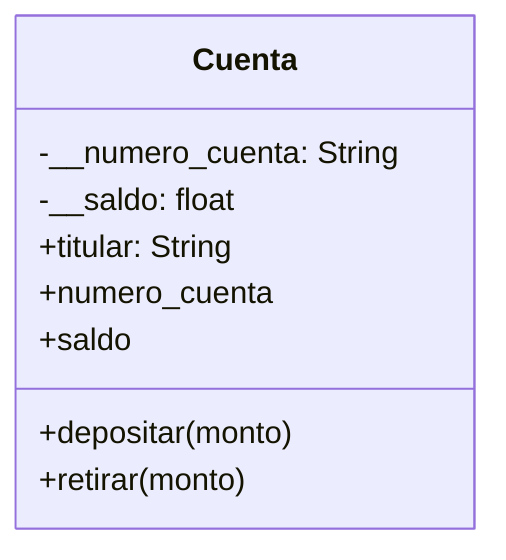

1. Un banco necesita desarrollar un módulo para gestionar cuentas bancarias. Cada cuenta tiene las siguientes caracteristicas:
- saldo: Es un dato privado. Solo puede consultar. Se puede modificar únicamente a través de deposito y retiro
- deposito: Permite ingresar dinero, incrementando el saldo.
- retiro: Permite retirar dinero, siempre y cuando el saldo disponible sea suficiente.
- número de cuenta: Es privado. Puede consultarse, pero no puede modificarse una vez asignado.
- nombre del titular: Es público. Puede consultarse y modificarse libremente.
- Realiza el análisis y diagrama de clases de la clase Cuenta en el archivo ejercicio_01.md.
- Escribe el codigo en Python para la clase Cuenta en el archivo ejercicio_01.py.
- Implementa encapsulamiento para proteger los atributos sensibles
- Utiliza getters y setters para controlar el acceso y la modificación de los atributos.
- Propiedades para ofrecer una interfaz clara y segura al usuario del sistema.

Análisis

Requisitos:
- El banco necesita un sistema para gestionar cuentas bancarias.
- El saldo es un dato privado, solo puede consultarse.
- El saldo solo puede modificarse mediante los métodos depositar() y retirar().
- El número de cuenta es privado, solo puede consultarse y no modificarse.
- El nombre del titular es público, puede consultarse y modificarse libremente.
- Debe implementarse encapsulamiento para proteger los datos sensibles.
- Deben usarse propiedades (getters y setters) para el acceso seguro.

Objetos:
- Cuenta

Características:
Cuenta:
- __numero_cuenta: String
- titular: String
- __saldo: Float

Acciones:
- Cuenta:
    - depositar(monto)
    - retirar(monto)
    - numero_cuenta (propiedad solo lectura)
    - saldo (propiedad solo lectura)

