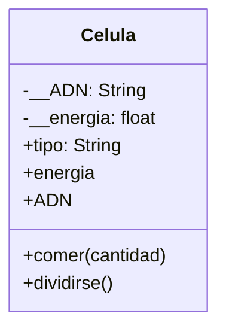

2. Un médico necesita simular el comportamiento de una célula. Cada célula debe cumplir con las siguientes características: 
- ADN: Se puede consultar pero no puede cambiar.
- tipo de célula: Puede consultarse y modificarse libremente.
- energía: Es un dato privado. Puede aumentar o disminuir, únicamente mediante las acciones de comer o dividirse.
- Realiza el análisis y el diagrama de clases de la clase Celula en el archivo ejercicio_02.md.
- Escribe el código en Python para la clase Celula en el archivo ejercicio_02.py.
- Implementa encapsulamiento para proteger los atributos sensibles.
- Utiliza getters y setters para controlar el acceso y la modificación de los atributos.
- Aplica propiedades para ofrecer una interfaz clara y segura al usuario del sistema.

Análisis

Requisitos:
- Se necesita simular el comportamiento de una célula.
- El ADN es privado: puede consultarse pero no modificarse.
- El tipo de célula es público: puede consultarse y modificarse libremente.
- La energía es privada: solo puede cambiar al comer o dividirse.
- Debe usarse encapsulamiento para proteger los atributos sensibles.
- Deben implementarse propiedades (getters y setters) para el acceso controlado.

Objetos:
- Célula

Características:
- Célula:
    - __ADN: String
    - tipo: String
    - __energia: Float

Acciones:
- Célula:
    - comer(cantidad)
    - dividirse()
    - energia (propiedad solo lectura)
    - ADN (propiedad solo lectura)

