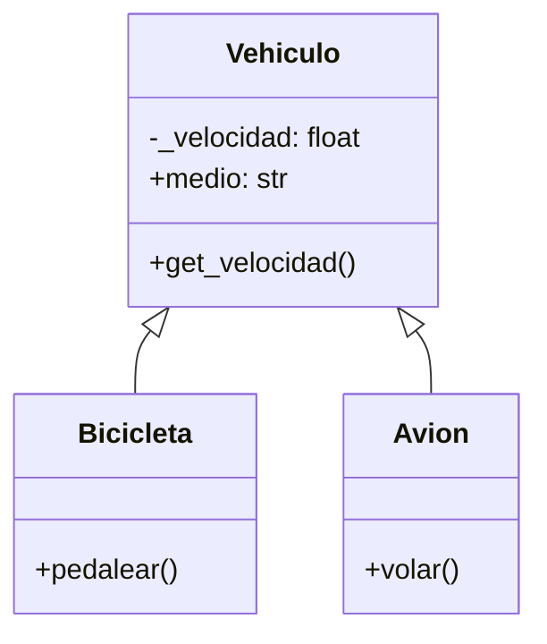

1. Una empresa de transporte desea desarrollar una simulación que represente el comportamiento de sus distintos vehículos.
Todo vehículo posee las siguientes características:
- velocidad: Es un dato protegido. Puede consultarse, pero solo modificarse mediante acciones específicas.
- medio: Representa el entorno en el que se desplaza el vehículo (por ejemplo, terrestre, acuático, aéreo). Puede consultarse y modificarse libremente.

Existen dos tipos de vehículos con características específicas:
- Bicicleta: Incrementar su velocidad mediante la acción de pedalear.
- Avión: Incrementar su velocidad mediante la acción de volar.

Realiza el análisis y el diagrama de clases de las clases Vehiculo, Bicicleta y Avion en el archivo ejercicio_01.md.
Escribe el código en Python para las clases Vehiculo, Bicicleta y Avion en el archivo ejercicio_01.py.
Aplica herencia de manera adecuada para el contexto de este ejercicio.

# Análisis
Requisitos:
- Simular vehículos de una empresa de transporte.
- Todos los vehículos tienen una velocidad (dato protegido) y un medio (terrestre, acuático, aéreo).
- La velocidad puede consultarse, pero solo modificarse mediante acciones específicas.
- La bicicleta puede aumentar su velocidad al pedalear.
- El avión puede aumentar su velocidad al volar.
- Se requiere aprovechar la herencia para reutilizar código.

Objetos:
- Vehiculo (clase padre)
- Bicicleta (clase hija)
- Avion (clase hija)

Características:
- Vehiculo:
    - _velocidad: float
    - medio: str
- Bicicleta:
    - _velocidad: float (heredada)
    - medio: str (heredado)
- Avion:
    - _velocidad: float (heredada)
    - medio: str (heredado)

Acciones:
- Vehiculo:
    - get_velocidad()
- Bicicleta:
    - pedalear()
- Avion:
    - volar()

