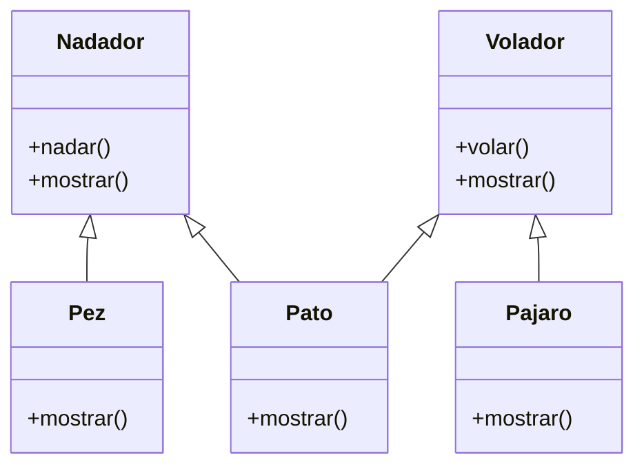

2. Debes desarrollar un videojuego tipo aventura, donde los personajes tiene distintas habilidades
Cada personaje pertenece a uno o más tipos que definen sus comportamientos:
- Nadador: Puede ejecutar la acción nadar(), que representa la acción de desplazarse en el agua.
- Volador: Puede ejecutar la acción volar(), que representa la acción de desplazarse por el aire.

En el juego existen tres personajes principales, cada uno con habilidades específicas:
- Pez: tiene la habilidad de nadar.
- Pájaro: tiene la habilidad de volar.
- Pato: tiene ambas habilidades, puede nadar y volar.
Cada personaje debe contar con un método mostrar() que indique el tipo de personaje y su habilidad principal o combinada.

Realiza el análisis y diagrama de clases de las clases Nadador, Volador, Pez, Pajaro y Pato en el archivo ejercicio_02.md.
Escribe el código en Python de las clases Nadador, Volador, Pez, Pajaro y Pato en el archivo ejercicio_02.py.
Aplica herencia múltiple de manera adecuada para el contexto de este ejercicio.
Utiliza un método mostrar() en cada clase para identificar al personaje y sus habilidades.

# Análisis
Requisitos:
- Desarrollar un videojuego de aventura con personajes que poseen habilidades especiales.
- Cada personaje pertenece a uno o más tipos que definen sus comportamientos:
    - Nadador puede nadar.
    - Volador puede volar.
- Existen tres personajes:
    - Pez: puede nadar.
    - Pájaro: puede volar.
    - Pato: puede nadar y volar.
- Cada personaje debe tener un método mostrar() que indique su tipo y habilidades.
- Se debe aplicar herencia múltiple para los personajes con habilidades combinadas.

Objetos:
- Nadador (clase base)
- Volador (clase base)
- Pez (clase hija)
- Pajaro (clase hija)
- Pato (clase hija, hereda de Nadador y Volador)

Características:
- Nadador:
    - habilidad: str
- Volador:
    - habilidad: str
- Pez:
    - habilidad: str (heredada)
- Pajaro:
    - habilidad: str (heredada)
- Pato:
    - habilidades combinadas

Acciones:
- Nadador:
    - nadar()
    - mostrar()
- Volador:
    - volar()
    - mostrar()
- Pez:
    - mostrar()
- Pajaro:
    - mostrar()
- Pato:
    - mostrar()

