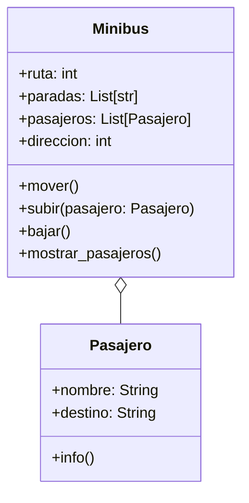

1. En su trayecto diario al trabajo, las personas pueden abordar distintos minibuses. Cada minibus está identificado por un número de ruta y sigue un recorrido compuesto por varias paradas (ubicaciones). Por otro lado, cada pasajero tiene un nombre y una ubicación de destino a la que desea llegar.

Los pasajeros pueden subir o bajar del minibus en cualquier parada, pero bajo las siguientes condiciones:
- Un pasajero solo puede subir si el recorrido del minibus incluye su destino entre las paradas programadas.
- Un pasajero solo puede bajar si la parada actual del minibus coincide con su destino.
- Las paradas son circulares: al llegar al final del recorrido, el minibus invierte su lista de paradas y regresa en sentido contrario.

- Diseñar las clases necesarias para representar Minibus y Pasajero.
- Toma en cuenta las siguientes características:
    - Un minibus tiene una lista de paradas programadas (ejemplo: ["Arce", "Prado", "Perez"]).
    - Un minibus puede transportar múltiples pasajeros.
- Simular el movimiento del minibus entre paradas y las acciones de subida y bajada de pasajeros.
- Realiza el análisis y diagrama de clases para las clases Minibus y Pasajero en el archivo ejercicio_01.md.
- Escribe el código en Python para las clases Minibus y Pasajero en el archivo ejercicio_01.py.
- Aplica los principios de relaciones entre las clases (composición o agregación según corresponda).
- Asegúrate de que las clases incluyan atributos y métodos coherentes con su propósito.
- Utiliza buenas prácticas de nomenclatura, encapsulamiento y legibilidad.

# Análisis:

Requisitos:
- Representar un minibus con una lista de paradas.
- Simular movimiento circular (ida y vuelta).
- Subida y bajada de pasajeros.

Objetos:
- Pasajero
- Minibus

Características:
- Pasajero:
    - nombre: String
    - destino: String
- Minibus:
    - ruta: int
    - paradas: List[str]
    - pasajeros: List[Pasajero]
    - direccion: int (1 = ida, -1 = vuelta)

Acciones:
- Pasajero:
    - info()
- Minibus:
    - mover()
    - subir(pasajero)
    - bajar()
    - mostrar_pasajeros()

