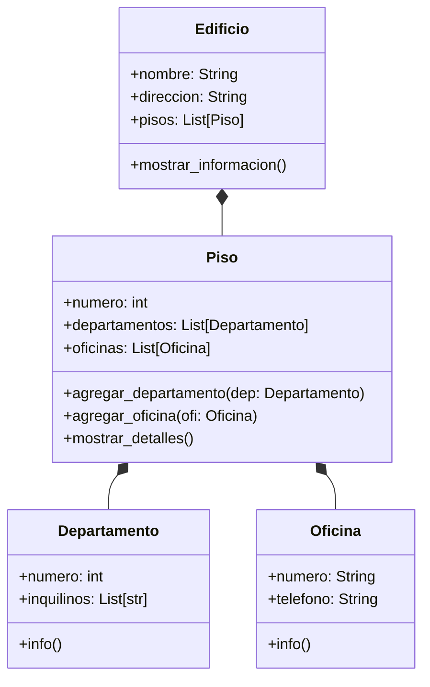

2. Se debe modelar un edificio ubicado en la ciudad de La Paz, compuesto por 3 pisos.
- Cada piso contiene una combinación de departamentos y oficinas 
- Cada departamento tiene un número que comienza con el número del piso seguido de un número de unidad (por ejemplo: 201, 304). 
- Cada oficina tiene un número que comienza con el número del piso seguido de una letra (por ejemplo: 2A, 3C). 

Además: 
- El edificio tiene direccion y nombre. 
- Los pisos tienen un atributo numero 
- Las oficinas cuentan con un atributo telefono. 
- Los departamentos tienen un atributo inquilinos. 

El sistema debe permitir: 
- Crear un edificio con sus pisos correspondientes. 
- Agregar departamentos y oficinas a cada piso. 
- Acceder y mostrar la información del edificio de forma organizada y jerárquica 

Realiza el análisis y diagrama de clases de las clases Edificio, Piso, Departamento y Oficina en el archivo ejercicio_02.md. 
Escribe el código en Python de las clases Edificio, Piso, Departamento y Oficina en el archivo ejercicio_02.py. 
Implementa relaciones jerárquicas entre objetos: 
- Un edificio contiene varios pisos. 
- Cada piso contiene varios departamentos y oficinas 

Aplica los principios de relaciones entre las clases (composición o agregación según corresponda). 
Utiliza atributos y métodos adecuados para representar y mostrar la información de cada entidad. 
Utiliza buenas prácticas de nomenclatura, encapsulamiento y legibilidad.

# Análisis:

Requisitos:
- Crear un edificio con pisos.
- Cada piso tiene departamentos y oficinas.
- Mostrar la información jerárquicamente.

Objetos:
- Edificio
- Piso
- Departamento
- Oficina

Características:
- Edificio:
    - nombre: String
    - direccion: String
    - pisos: List[Piso]

- Piso:
    - numero: int
    - departamentos: List[Departamento]
    - oficinas: List[Oficina]

- Departamento:
    - numero: int
    - inquilinos: List[str]

- Oficina:
    - numero: str
    - telefono: str

Acciones:

- Edificio:
    - mostrar_informacion()

- Piso:
    - agregar_departamento(dep)
    - agregar_oficina(ofi)
    - mostrar_detalles()

- Departamento y Oficina:
    -   info()

