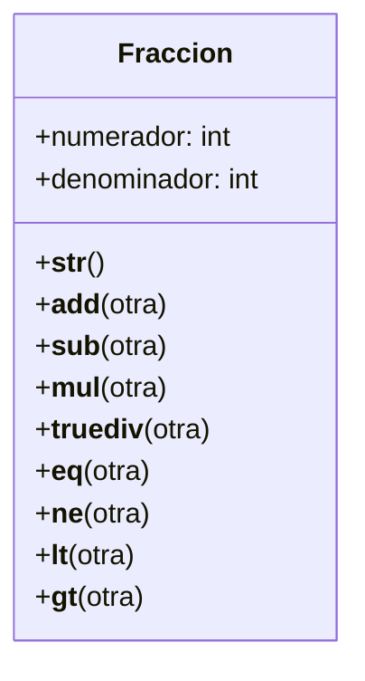

# Ejercicio 01 – Fracciones con métodos especiales

# Enunciado
Un profesor de matemáticas necesita una calculadora de fracciones para enseñar conceptos básicos de aritmética.  
Cada fracción tiene un numerador y un denominador.  

# Análisis

## Requisitos
- Registrar fracciones definidas por un numerador y un denominador.
- Permitir representar una fracción con el formato texto “numerador/denominador”.
- Permitir sumar una fracción con otra.
- Permitir restar una fracción con otra.
- Permitir multiplicar una fracción con otra.
- Permitir dividir una fracción con otra.
- Permitir comparar dos fracciones para saber si representan el mismo valor.
- Permitir comparar dos fracciones para determinar cuál representa un valor menor.
- Permitir comparar dos fracciones para determinar cuál representa un valor mayor.
- Permitir verificar si dos fracciones representan valores distintos.
- Mantener el numerador y el denominador tal como se registran (sin reducir la fracción).
- Permitir crear múltiples fracciones y realizar operaciones entre ellas.
- Permitir verificar los resultados obtenidos a través de comparaciones y operaciones aritméticas.

## Objetos
- Fraccion

## Características
- Fraccion: 
    - numerador: entero  
    - denominador: entero

## Acciones
 - __str__()            representacion
 - __add__(otra)        suma
 - __sub__(otra)        resta
 - __mul__(otra)        multiplicacion
 - __truediv__(otra)    división
 - __eq__(otra)         igualdad
 - __ne__(otra)         desigualdad
 - __lt__(otra)         menor_que
 - __gt__(otra)         mayor_que

# Diagrama de clases

