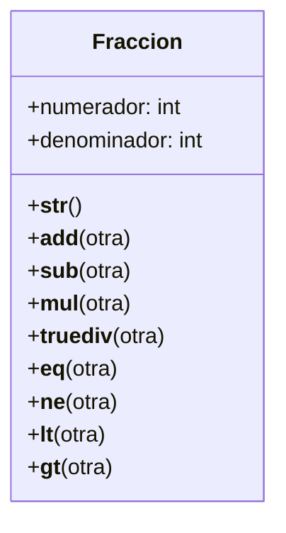

# Ejercicio 01 – Fracciones con métodos especiales

# Enunciado
Un profesor de matemáticas necesita una calculadora de fracciones para enseñar conceptos básicos de aritmética.  
Cada fracción tiene un numerador y un denominador.  
La clase debe permitir:

- Ver la fracción como `"numerador/denominador"`
- Sumar fracciones con +
- Restar fracciones con -
- Multiplicar fracciones con *
- Dividir fracciones con /
- Comparar fracciones con:
  - ==
  - !=
  - <
  - >

# Análisis

## Requisitos
- La clase debe representar una fracción mediante numerador y denominador.
- Debe implementar los métodos especiales:
  - `__str__` para la representación.
  - `__add__`, `__sub__`, `__mul__`, `__truediv__` para operaciones.
  - `__eq__`, `__ne__`, `__lt__`, `__gt__` para comparaciones.
- Debe permitir operar solo con objetos de tipo Fraccion.
- La fracción NO se reducirá a su mínima expresión.

## Objetos
- Fraccion

## Características
- Fraccion: numerador, denominador

## Acciones
- Representación: `__str__`
- Sumar: `__add__`
- Restar: `__sub__`
- Multiplicar: `__mul__`
- Dividir: `__truediv__`
- Comparar: `__eq__`, `__ne__`, `__lt__`, `__gt__`

---

# Diagrama de clases

