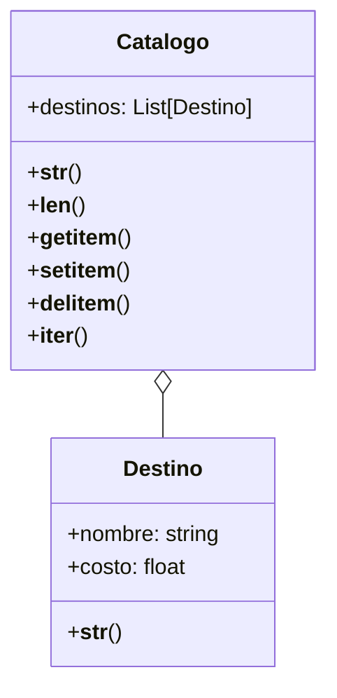

# Ejercicio 02 – Catálogo de destinos turísticos

# Análisis

## Requisitos
- Registrar destinos turísticos que incluyan un nombre y un costo en dólares.
- Mostrar cada destino con el formato textual: "[nombre] ➡ [costo] USD".
- Mantener una colección de destinos dentro de un catálogo de viajes.
- Mostrar el catálogo con el formato:
 🗺 Destinos 🗺
1. destino1
2. destino2
- Permitir conocer cuántos destinos hay en el catálogo.
- Permitir acceder a un destino según su posición en la lista.
- Permitir reemplazar un destino por otro en una posición específica.
- Permitir eliminar un destino según su posición.
- Permitir recorrer los destinos uno por uno, en orden, como si fuera una lista.
- Permitir agregar destinos al catálogo.
- Permitir visualizar el catálogo completo de forma clara y ordenada.
- Permitir visualizar individualmente cualquier destino del catálogo.

## Objetos
- Destino
- Catalogo

## Características
- Destino
    - nombre: String  
    - costo: número (entero o decimal)

- Catalogo
    - destinos: lista de objetos Destino

## Acciones
- Destino:
    - __str__()              representación
- Catalogo: 
    - __str__()              representación_catalogo
    - __len__()              cantidad_destinos
    - __getitem__(indice)    obtener_destino
    - __setitem__(indice)    modificar_destino
    - __delitem__(indice)    eliminar_destino
    - __iter__()             recorrer_destinos

# Diagrama de clases

