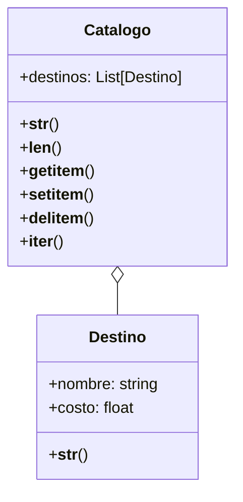

---

# Análisis

## Requisitos
- Se necesitan dos clases: Destino y Catalogo.
- Un destino tiene nombre y costo.
- El catálogo almacena una lista de destinos.
- El catálogo debe implementar métodos especiales:
  - `__len__`
  - `__getitem__`
  - `__setitem__`
  - `__delitem__`
  - `__iter__`
  - `__str__`

## Objetos
- Destino
- Catalogo

## Características
- Destino: nombre, costo
- Catalogo: lista de destinos

## Acciones
- Destino: representación `__str__`
- Catalogo: longitud, acceso, modificación, eliminación, iteración, representación

---

# Diagrama de clases

