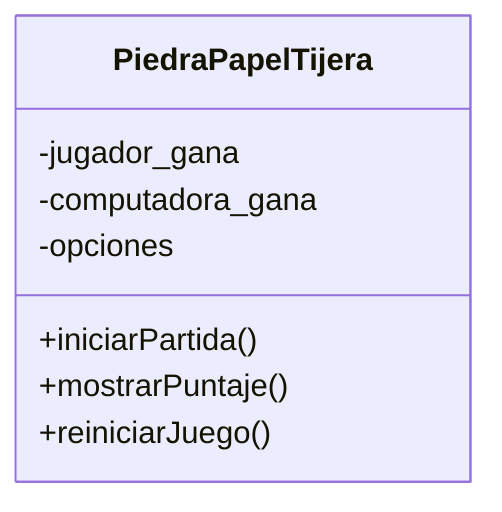

# Análisis

## Requisitos
- Mantener una única instancia del juego durante toda la ejecución.
- Registrar las partidas ganadas por el jugador.
- Registrar las partidas ganadas por la computadora.
- Permitir que el jugador elija entre piedra, papel o tijera.
- Permitir que la computadora elija entre piedra, papel o tijera.
- Comparar las elecciones para determinar al ganador.
- Mostrar el puntaje acumulado.
- Reiniciar los puntajes cuando sea necesario.
- Permitir varias partidas mediante un menú interactivo.

## Objetos
- PiedraPapelTijera

## Características

### PiedraPapelTijera
- jugador_gana
- computadora_gana
- opciones

## Acciones

### PiedraPapelTijera
- iniciarPartida → jugar una ronda
- mostrarPuntaje → mostrar el puntaje
- reiniciarJuego → reiniciar los puntajes

# Diseño

## Clases:
- **PiedraPapelTijera**
    - **Nombre:** PiedraPapelTijera
    - **Atributos:**
        - jugador_gana
        - computadora_gana
        - opciones
    - **Métodos:**
        - iniciarPartida
        - mostrarPuntaje
        - reiniciarJuego

# Diagrama de clases

