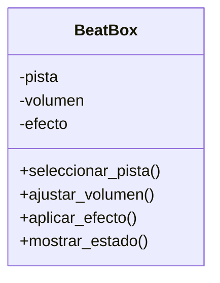

# Análisis

## Requisitos
- Mantener una única consola BeatBox durante la ejecución.
- Permitir seleccionar una pista de audio.
- Permitir subir o bajar el volumen.
- Aplicar un único efecto de sonido: eco, reverb o distorsión.
- Mostrar la pista seleccionada, el volumen y el efecto activo.
- Permitir que el usuario interactúe mediante un menú.

## Objetos
- BeatBox

## Características

### BeatBox
- pista
- volumen
- efecto

## Acciones

### BeatBox
- seleccionar_pista → elegir una pista
- ajustar_volumen → modificar el volumen
- aplicar_efecto → activar un efecto
- mostrar_estado → mostrar la configuración actual

# Diseño

## Clases:
- **BeatBox**
    - **Nombre:** BeatBox
    - **Atributos:**
        - pista
        - volumen
        - efecto
    - **Métodos:**
        - seleccionar_pista
        - ajustar_volumen
        - aplicar_efecto
        - mostrar_estado

# Diagrama de clases

