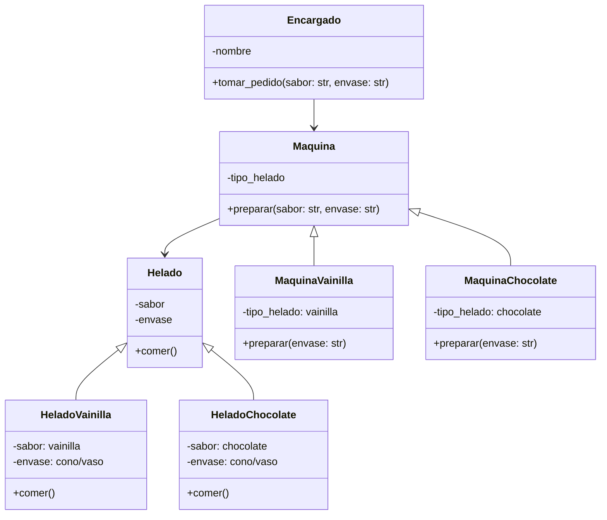

# Análisis

## Requisitos
- Se preparan helados de dos sabores: vainilla o chocolate.
- Los helados se pueden servir en dos tipos de envase: cono o vaso.
- La máquina de vainilla solo prepara helados de vainilla.
- La máquina de chocolate solo prepara helados de chocolate.
- Cada maquina produce un tipo de helado.
- Un cliente puede pedir el helado que desea.
- Cada pedido debe incluir el sabor y el envase del helado.
- El cliente puede hacer múltiples pedidos de helado hasta que decida escribir "salir".
- Los helados deben ser representados en el formato: "[sabor] 🍦 en [envase]".
- Todos los helados se pueden comer.

## Objetos
- Helado (HeladoVainilla, HeladoChocolate)
- Maquina (MaquinaVainilla, MaquinaChocolate)
- Encargado

## Características
- Helado:
    - sabor
    - envase

- HeladoVainilla:
    - sabor: vainilla
    - envase: cono/vaso

- HeladoChocolate:
    - sabor: chocolate
    - envase: cono/vaso

- Maquina:
    - tipo_helado

- MaquinaVainilla:
    - tipo_helado: vainilla

- MaquinaChocolate:
    - tipo_helado: chocolate

- Encargado:
    - nombre

## Acciones

- Helado:
    - comer() → el cliente come el helado.
-  HeladoVainilla: 
    - comer()
- HeladoChocolate:
    - comer()

- Maquina:
    - preparar(sabor: str, envase: str) → prepara el helado solicitado según el sabor y el tipo de envase.

- MaquinaVainilla:
    - preparar(envase: str) → prepara helado de vainilla con el tipo de envase solicitado.

- MaquinaChocolate:
    - preparar(envase: str) → prepara helado de chocolate con el tipo de envase solicitado.

- Encargado:
    - tomar_pedido(sabor: str, envase: str) → recibe el pedido del cliente y crea el helado correspondiente según el sabor y el envase solicitados.

---

# Diseño

## Clases:

- **Helado:**
    - **Nombre:** Helado
    - **Atributos:**
        - sabor
        - envase
    - **Métodos:**
        - comer()

- **HeladoVainilla:**
    - **Nombre:** HeladoVainilla
    - **Atributos:**
        - sabor: vainilla
        - envase: cono/vaso
    - **Métodos:**
        - comer()

- **HeladoChocolate:**
    - **Nombre:** HeladoChocolate
    - **Atributos:**
        - sabor: chocolate
        - envase: cono/vaso
    - **Métodos:**
        - comer()

- **Maquina:**
    - **Nombre:** Maquina
    - **Atributos:**
        - tipo_helado
    - **Métodos:**
        - preparar()

- **MaquinaVainilla:**
    - **Nombre:** MaquinaVainilla
    - **Atributos:**
        - tipo_helado: vainilla
    - **Métodos:**
        - preparar()

- **MaquinaChocolate:**
    - **Nombre:** MaquinaChocolate
    - **Atributos:**
        - tipo_helado: chocolate
    - **Métodos:**
        - preparar()

- **Encargado:**
    - **Nombre:** Encargado
    - **Atributos:** 
        - nombre
    - **Métodos:**
        - tomar_pedido()

---

# Diagrama de clases
