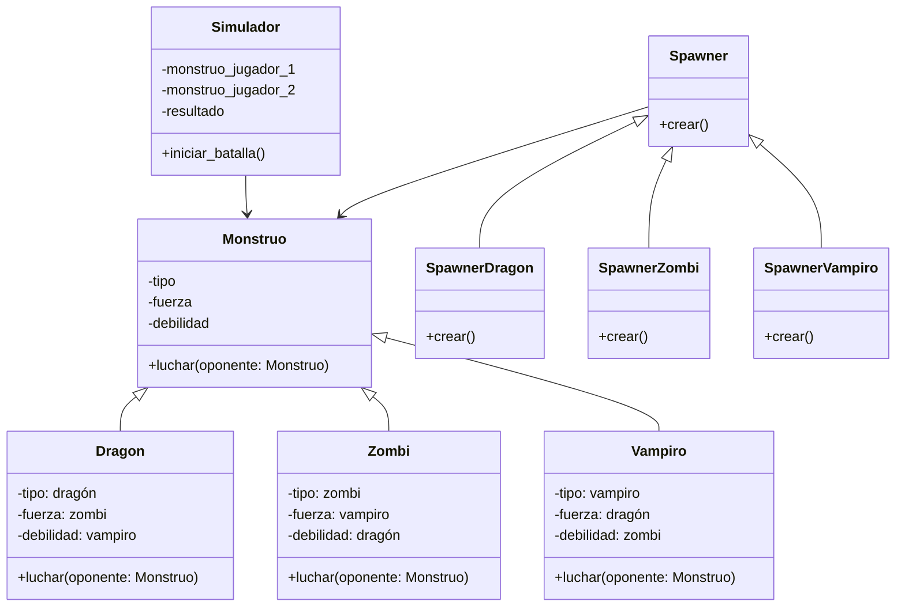

# Análisis

## Requisitos
- Dos jugadores pueden elegir un monstruo para luchar.
- Cada jugador puede elegir entre tres tipos de monstruos: dragón, zombi y vampiro.
- Cada monstruo tiene fortalezas y debilidades:
    - El Dragón es fuerte contra Zombi, débil contra Vampiro y igual contra otro Dragón.
    - El Zombi es fuerte contra Vampiro, débil contra Dragón y igual contra otro Zombi.
    - El Vampiro es fuerte contra Dragón, débil contra Zombi y igual contra otro Vampiro.
 El juego debe determinar el ganador de la batalla entre los monstruos elegidos.
- Si un jugador escribe "salir", el juego termina.
- Los monstruos deben ser representados en el formato: "[monstruo] 🧟‍♂️ listo para luchar".
- Debe permitir crear monstruos mediante una fábrica.
- Determinar el resultado de la batalla según las fortalezas y debilidades.

## Objetos
- Monstruo (Dragón, Zombi, Vampiro)
- Spawner (SpawnerDragon, SpawnerZombi, SpawnerVampiro)
- Simulador

## Características

- Monstruo:
    - tipo
    - fuerza
    - debilidad

- Dragon:
    - tipo: dragón
    - fuerza: zombi
    - debilidad: vampiro

- Zombi:
    - tipo: zombi
    - fuerza: vampiro
    - debilidad: dragón

- Vampiro:
    - tipo: vampiro
    - fuerza: dragón
    - debilidad: zombi

- Spawner:
    - tipo_monstruo

- SpawnerDragon:
    - tipo_monstruo: dragón

- SpawnerZombi:
    - tipo_monstruo: zombi

- SpawnerVampiro:
    - tipo_monstruo: vampiro

- Simulador:
    - monstruo_jugador_1
    - monstruo_jugador_2
    - resultado

## Acciones

- Monstruo:
    - luchar(oponente: Monstruo) → determina el resultado de la batalla entre los dos monstruos comparando sus fortalezas y debilidades.
- Dragon:
    - luchar
- Zombi:
    - luchar
- Vampiro:
    - luchar

- Spawner:
    - crear() → crea el monstruo seleccionado por el jugador.

- SpawnerDragon:
    - crear() → crea un dragón.

- SpawnerZombi:
    - crear() → crea un zombi.

- SpawnerVampiro:
    - crear() → crea un vampiro.

- Simulador:
    - iniciar_batalla() → gestiona el proceso de selección de monstruos y determina el ganador de la batalla.

---

# Diseño

## Clases:

- **Monstruo:**
    - **Nombre:** Monstruo
    - **Atributos:**
        - tipo
        - fuerza
        - debilidad
    - **Métodos:**
        - luchar(oponente: Monstruo)

- **Dragon:**
    - **Nombre:** Dragon
    - **Atributos:**
        - tipo: dragón
        - fuerza: zombi
        - debilidad: vampiro
    - **Métodos:**
        - luchar(oponente: Monstruo)

- **Zombi:**
    - **Nombre:** Zombi
    - **Atributos:**
        - tipo: zombi
        - fuerza: vampiro
        - debilidad: dragón
    - **Métodos:**
        - luchar(oponente: Monstruo)

- **Vampiro:**
    - **Nombre:** Vampiro
    - **Atributos:**
        - tipo: vampiro
        - fuerza: dragón
        - debilidad: zombi
    - **Métodos:**
        - luchar(oponente: Monstruo)

- **Spawner:**
    - **Nombre:** Spawner
    - **Atributos:** Ninguno
    - **Métodos:**
        - crear()

- **SpawnerDragon:**
    - **Nombre:** SpawnerDragon
    - **Atributos:** Ninguno
    - **Métodos:**
        - crear()

- **SpawnerZombi:**
    - **Nombre:** SpawnerZombi
    - **Atributos:** Ninguno
    - **Métodos:**
        - crear()

- **SpawnerVampiro:**
    - **Nombre:** SpawnerVampiro
    - **Atributos:** Ninguno
    - **Métodos:**
        - crear()

- **Simulador:**
    - **Nombre:** Simulador
    - **Atributos:**
        - monstruo_jugador_1
        - monstruo_jugador_2
        - resultado
    - **Métodos:**
        - iniciar_batalla()

---

# Diagrama de clases

