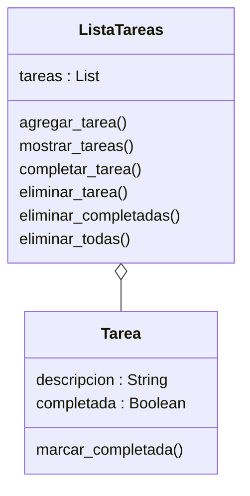

# Análisis

## Requisitos
- Permitir agregar nuevas tareas.
- Permitir eliminar tareas por su posición.
- Permitir marcar tareas como completadas.
- Permitir eliminar solo las tareas completadas.
- Permitir eliminar todas las tareas registradas.
- Mostrar la lista de tareas con su estado actual.
- Permitir la interacción mediante un menú en consola.

## Objetos
- Tarea
- ListaTareas

## Características

### Tarea
- descripcion
- completada

### ListaTareas
- tareas

## Acciones

### Tarea
- marcar_completada: cambia el estado de la tarea

### ListaTareas
- agregar_tarea: registra una tarea
- mostrar_tareas: lista tareas
- completar_tarea: marca una tarea
- eliminar_tarea: elimina una tarea
- eliminar_completadas: elimina tareas completadas
- eliminar_todas: elimina todas las tareas

# Diseño

## Clases

- **Tarea**
  - Atributos:
    - descripcion : String
    - completada : Boolean
  - Métodos:
    - marcar_completada()

- **ListaTareas**
  - Atributos:
    - tareas : List
  - Métodos:
    - agregar_tarea()
    - mostrar_tareas()
    - completar_tarea()
    - eliminar_tarea()
    - eliminar_completadas()
    - eliminar_todas()

# Diagrama de clases

