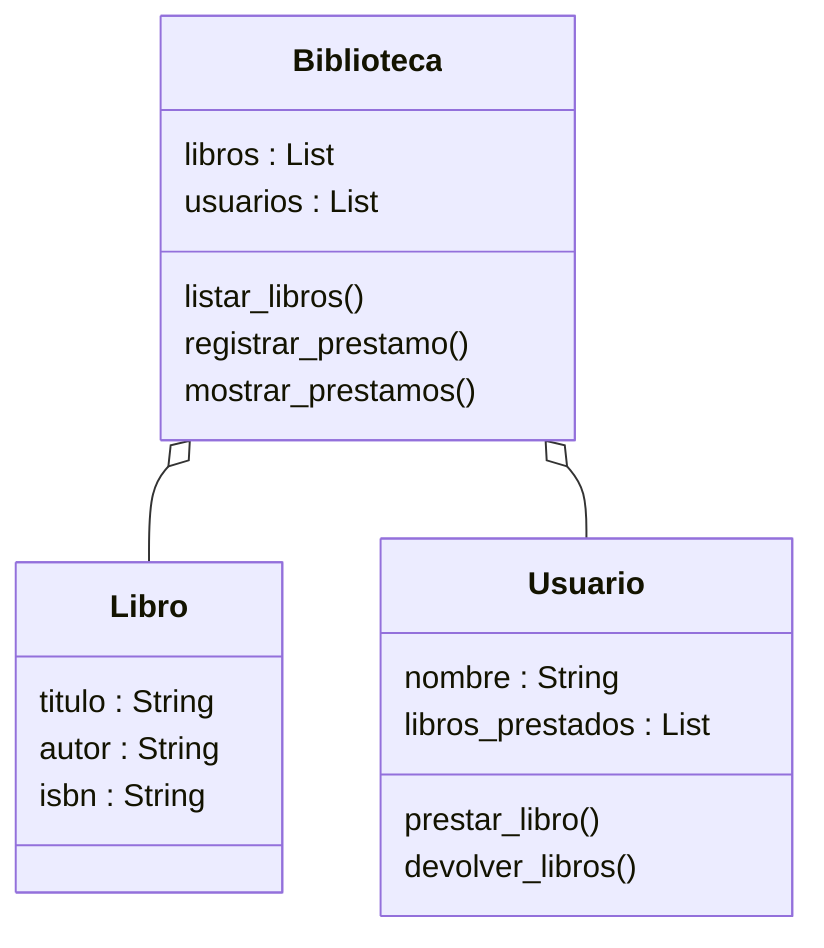

# Análisis

## Requisitos
- Registrar libros con título, autor e ISBN.
- Registrar usuarios por su nombre.
- Permitir prestar libros a un usuario.
- Permitir prestar más de un libro al mismo usuario.
- Registrar los libros prestados junto al usuario.
- Permitir devolver todos los libros de un usuario.
- Mostrar la lista de préstamos actuales.
- Permitir salir del sistema escribiendo "salir".

## Objetos
- Libro
- Usuario
- Biblioteca

## Características

### Libro
- titulo
- autor
- isbn

### Usuario
- nombre
- libros_prestados

### Biblioteca
- libros
- usuarios

## Acciones

### Usuario
- prestar_libro
- devolver_libros

### Biblioteca
- listar_libros
- registrar_prestamo
- mostrar_prestamos

# Diseño

## Clases

- **Libro**
  - Atributos:
    - titulo : String
    - autor : String
    - isbn : String
  - Métodos:
    - -

- **Usuario**
  - Atributos:
    - nombre : String
    - libros_prestados : List
  - Métodos:
    - prestar_libro()
    - devolver_libros()

- **Biblioteca**
  - Atributos:
    - libros : List
    - usuarios : List
  - Métodos:
    - listar_libros()
    - registrar_prestamo()
    - mostrar_prestamos()

# Diagrama de clases

