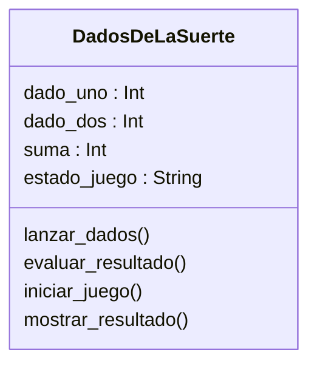

# Análisis

## Requisitos
- El jugador puede iniciar una partida del juego.
- El juego lanza automáticamente dos dados.
- El juego calcula la suma de los valores obtenidos.
- Si la suma es 7 u 11, el jugador gana.
- Si la suma es 2, 3 o 12, el jugador pierde.
- Si la suma es otro valor, el jugador puede volver a lanzar los dados.
- El jugador puede decidir si desea continuar o finalizar el juego.
- El juego muestra un mensaje final indicando el resultado.

## Objetos
- DadosDeLaSuerte

## Características

### DadosDeLaSuerte
- dado_uno
- dado_dos
- suma
- estado_juego

## Acciones

### DadosDeLaSuerte
- lanzar_dados: genera valores aleatorios
- evaluar_resultado: determina si gana, pierde o continúa
- iniciar_juego: controla el flujo del juego
- mostrar_resultado: muestra mensajes al jugador

# Diseño

## Clases:
- **DadosDeLaSuerte**
    - **Nombre:** DadosDeLaSuerte
    - **Atributos:**
        - dado_uno : Int
        - dado_dos : Int
        - suma : Int
        - estado_juego : String
    - **Métodos:**
        - lanzar_dados()
        - evaluar_resultado()
        - iniciar_juego()
        - mostrar_resultado()

# Diagrama de clases

