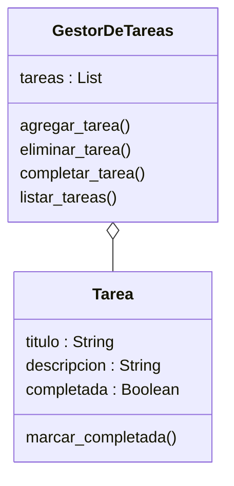

# Análisis

## Requisitos
- El usuario puede agregar nuevas tareas.
- Cada tarea tiene un título, una descripción y un estado.
- El usuario puede eliminar tareas existentes.
- El usuario puede marcar tareas como completadas.
- El usuario puede listar todas las tareas con su estado actual.
- El sistema permite gestionar múltiples tareas.
- La interacción se realiza mediante un menú.

## Objetos
- Tarea
- GestorDeTareas

## Características

### Tarea
- titulo
- descripcion
- completada

### GestorDeTareas
- tareas

## Acciones

### Tarea
- marcar_completada → cambiar el estado

### GestorDeTareas
- agregar_tarea: registra una tarea
- eliminar_tarea: elimina una tarea
- completar_tarea: marca una tarea
- listar_tareas: muestra las tareas

# Diseño

## Clases:
- **Tarea**
    - **Atributos:**
        - titulo : String
        - descripcion : String
        - completada : Boolean
    - **Métodos:**
        - marcar_completada()

- **GestorDeTareas**
    - **Atributos:**
        - tareas : List
    - **Métodos:**
        - agregar_tarea()
        - eliminar_tarea()
        - completar_tarea()
        - listar_tareas()

# Diagrama de clases

